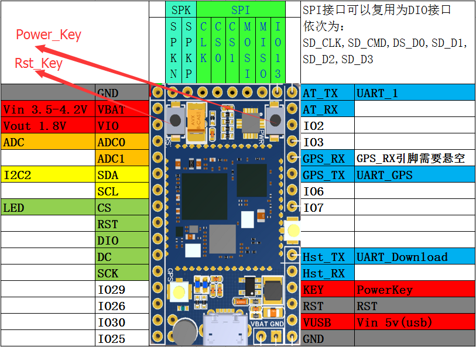

[安信可GPRS模块A9g学习之路](https://github.com/xuhongv/GPRS_A9G)
=====

&nbsp;&nbsp;&nbsp;因为大学时候未好好玩够 2G模块的 SDK 开发，所以出来社会，必须把这个玩下，于是乎，看中了安信可的 A9g 模块，因为它支持 SDK 内核开发，而且是 C 语言开发，集成了很多好玩的 demo ；

&nbsp;&nbsp;&nbsp;虽然现在 2g网络逐渐减弱，甚至联通都放弃了2g网络，但是有中国移动在坚持，所以，我相信 2g网络还是不会被取代的！

&nbsp;&nbsp;&nbsp;这个是我安信可GPRS模组片上(SoC)开发SDK C语言版的一些学习历程，A9G模块内核是基于RDA8955芯片的。


## (一) 硬件


### 1. A9/A9G GPRS(+GPS+BDS) 开发板


我使用的是A9/A9G开发板，方便开发和调试！

<p align="center">

</p>


##### 开发板引脚图

<p align="center">

</p>


## (二) 如何编译


#### 1. 下载代码

```
git clone --recursive https://github.com/xuhongv/GPRS_A9G
```
---

#### 2. 检查代码完整性

下载完后请检查目录`platform/csdk`目录写是否包含`debug`、`release`目录。如果没有，则是下载方式错误，请仔细阅读第一步下载正确的文件！

#### 3. 搭建编译环境

请移步到官网文档搭建：[windows环境](https://ai-thinker-open.github.io/GPRS_C_SDK_DOC/zh/c-sdk/kai-fa-huan-jing-an-zhuang.html)

#### 4. 编译工程

比如编译这个 微信小程序定位demo，可以cd 到本工程目录，然后：

```
 ./build.bat demo mqtt
 
```

## (官网文档) 开发文档


**文档地址： [GPRS C SDK 在线文档](https://ai-thinker-open.github.io/GPRS_C_SDK_DOC/zh/)**


